# DoclingGPU — Architecture Documentation

> Detailed architecture diagrams for the DoclingGPU application using Mermaid format.

---

## Table of Contents

1. [System Overview](#1-system-overview)
2. [Component Architecture](#2-component-architecture)
3. [Data Flow — Local Mode](#3-data-flow--local-mode)
4. [Data Flow — Fleet CPU Mode](#4-data-flow--fleet-cpu-mode)
5. [Data Flow — Fleet GPU Mode](#5-data-flow--fleet-gpu-mode)
6. [Deployment Architecture — IBM Code Engine](#6-deployment-architecture--ibm-code-engine)
7. [Deployment Architecture — Kubernetes](#7-deployment-architecture--kubernetes)
8. [Sequence Diagram — Document Processing](#8-sequence-diagram--document-processing)
9. [Sequence Diagram — Fleet Lifecycle](#9-sequence-diagram--fleet-lifecycle)
10. [State Machine — Job Lifecycle](#10-state-machine--job-lifecycle)
11. [Infrastructure — Terraform Provisioning](#11-infrastructure--terraform-provisioning)
12. [Container Architecture](#12-container-architecture)
13. [Network Architecture](#13-network-architecture)
14. [Security Architecture](#14-security-architecture)

---

## 1. System Overview

High-level view of the entire DoclingGPU system and its integration with IBM Cloud services.

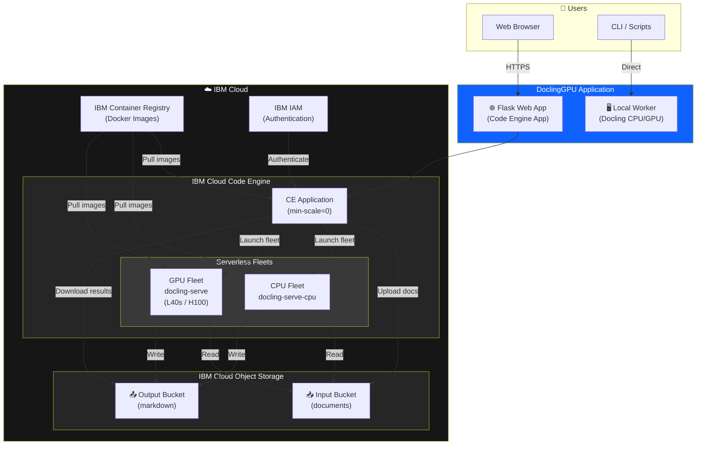

---

## 2. Component Architecture

Internal component breakdown of the DoclingGPU application.

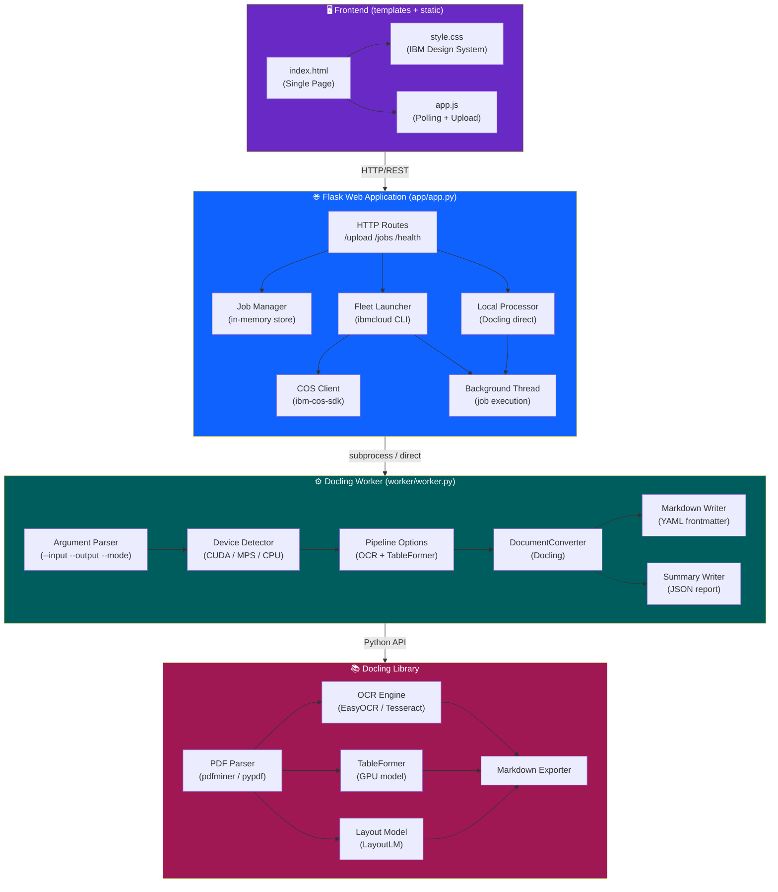

---

## 3. Data Flow — Local Mode

How documents flow through the system when processing locally.

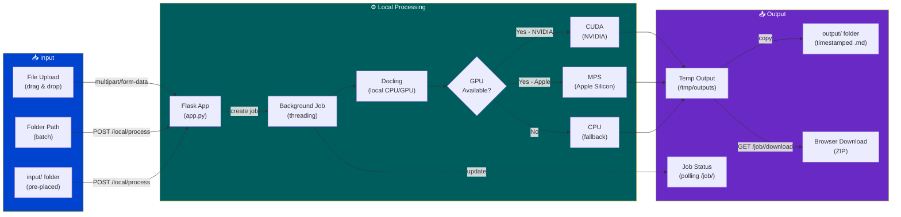

---

## 4. Data Flow — Fleet CPU Mode

How documents flow through the system when using Code Engine CPU fleet.

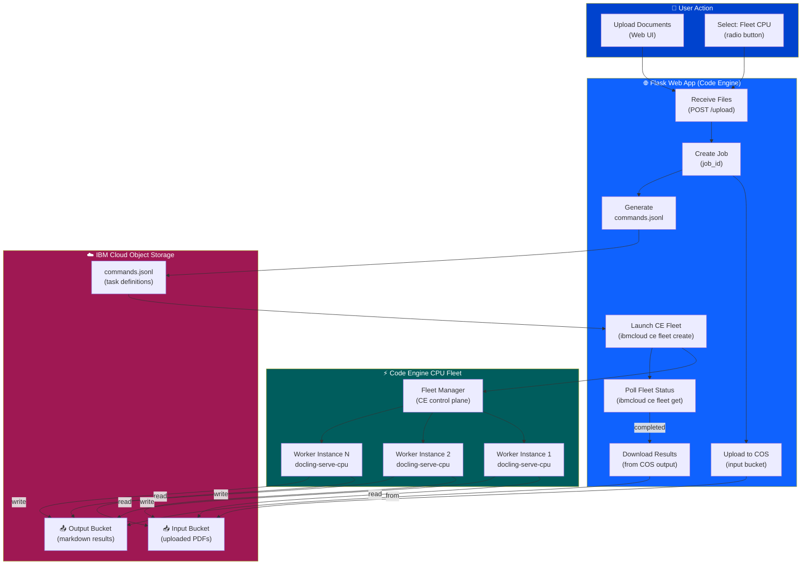

---

## 5. Data Flow — Fleet GPU Mode

How documents flow through the system when using Code Engine GPU fleet (L40s/H100).

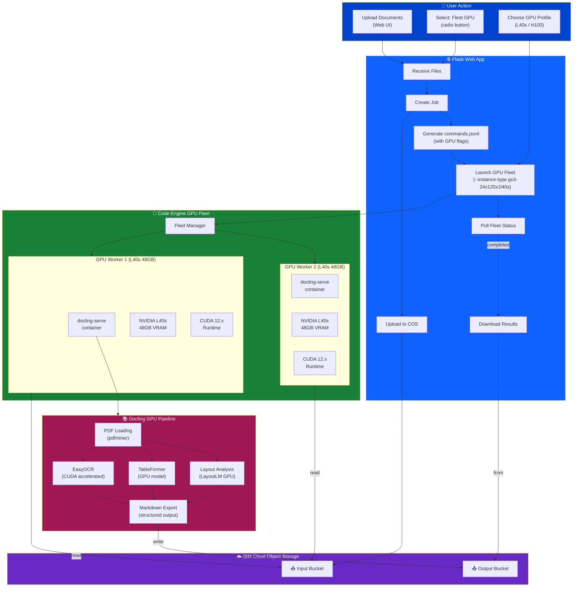

---

## 6. Deployment Architecture — IBM Code Engine

Full IBM Cloud Code Engine deployment topology.

```mermaid
graph TB
    subgraph Internet["🌐 Internet"]
        Users["Users\n(browsers)"]
    end

    subgraph IBMCloud["☁️ IBM Cloud (eu-de region)"]
        subgraph IAM["🔐 IBM IAM"]
            APIKey["API Key"]
            ServiceID["Service ID"]
            Policies["IAM Policies"]
        end

        subgraph ICR["📦 IBM Container Registry"]
            WebAppImage["doclinggpu-webapp:latest"]
            WorkerImage["doclinggpu-worker:latest"]
        end

        subgraph CodeEngine["🚀 IBM Cloud Code Engine Project: doclinggpu"]
            subgraph App["Application (serverless)"]
                AppInstance1["App Instance 1\n(Flask + Gunicorn)"]
                AppInstance2["App Instance 2\n(auto-scaled)"]
                AppConfig["CE App Config\nmin-scale=0\nmax-scale=5\ncpu=1 mem=4G"]
            end

            subgraph Secrets["Secrets & ConfigMaps"]
                CosSecret["cos-credentials\n(HMAC keys)"]
                AppSecret["app-secrets\n(SECRET_KEY)"]
                AppConfig2["app-config\n(env vars)"]
            end

            subgraph FleetCPU["CPU Fleet (on-demand)"]
                CPUWorker1["CPU Worker 1\ndocling-serve-cpu"]
                CPUWorker2["CPU Worker 2\ndocling-serve-cpu"]
                CPUWorkerN["CPU Worker N\n(auto-scaled)"]
            end

            subgraph FleetGPU["GPU Fleet (on-demand)"]
                GPUWorker1["GPU Worker 1\nL40s 48GB"]
                GPUWorker2["GPU Worker 2\nL40s 48GB"]
                GPUWorkerN["GPU Worker N\n(auto-scaled)"]
            end
        end

        subgraph COS["☁️ IBM Cloud Object Storage"]
            COSInstance["COS Instance\n(Standard)"]
            InputBucket["doclinggpu-input\nbucket"]
            OutputBucket["doclinggpu-output\nbucket"]
        end

        subgraph Monitoring["📊 IBM Cloud Monitoring"]
            LogDNA["IBM Log Analysis\n(application logs)"]
            SysDig["IBM Monitoring\n(metrics)"]
        end
    end

    Users -->|"HTTPS"| AppInstance1
    Users -->|"HTTPS"| AppInstance2
    AppInstance1 -->|"pull"| WebAppImage
    AppInstance2 -->|"pull"| WebAppImage
    AppInstance1 -->|"read"| CosSecret
    AppInstance1 -->|"upload"| InputBucket
    AppInstance1 -->|"download"| OutputBucket
    AppInstance1 -->|"launch"| FleetCPU
    AppInstance1 -->|"launch"| FleetGPU
    CPUWorker1 -->|"pull"| WorkerImage
    GPUWorker1 -->|"pull"| WorkerImage
    CPUWorker1 -->|"read"| InputBucket
    CPUWorker1 -->|"write"| OutputBucket
    GPUWorker1 -->|"read"| InputBucket
    GPUWorker1 -->|"write"| OutputBucket
    APIKey -->|"auth"| AppInstance1
    AppInstance1 -->|"logs"| LogDNA
    AppInstance1 -->|"metrics"| SysDig

    style Internet fill:#0043ce,color:#fff
    style IBMCloud fill:#161616,color:#fff
    style IAM fill:#6929c4,color:#fff
    style ICR fill:#005d5d,color:#fff
    style CodeEngine fill:#0f62fe,color:#fff
    style COS fill:#9f1853,color:#fff
    style Monitoring fill:#b28600,color:#fff
```

---

## 7. Deployment Architecture — Kubernetes

Alternative Kubernetes deployment topology for self-managed clusters.

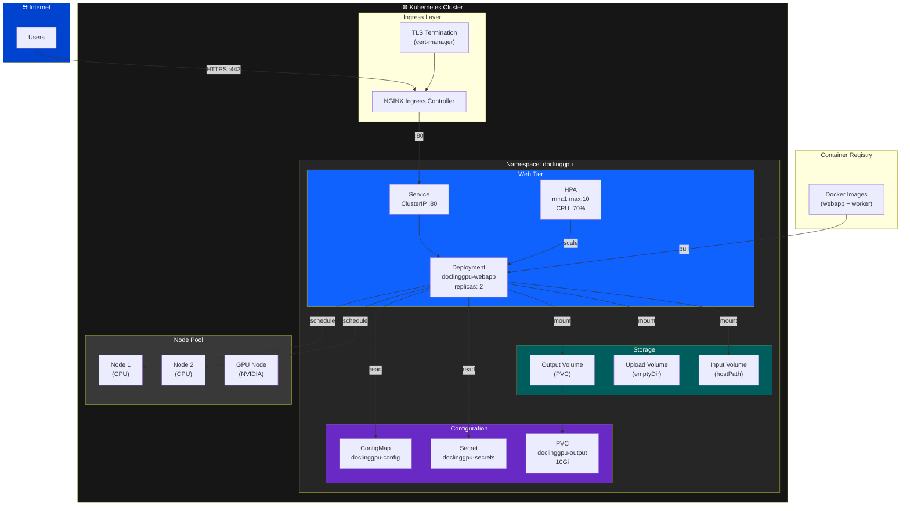

---

## 8. Sequence Diagram — Document Processing

End-to-end sequence for processing documents via the web UI.

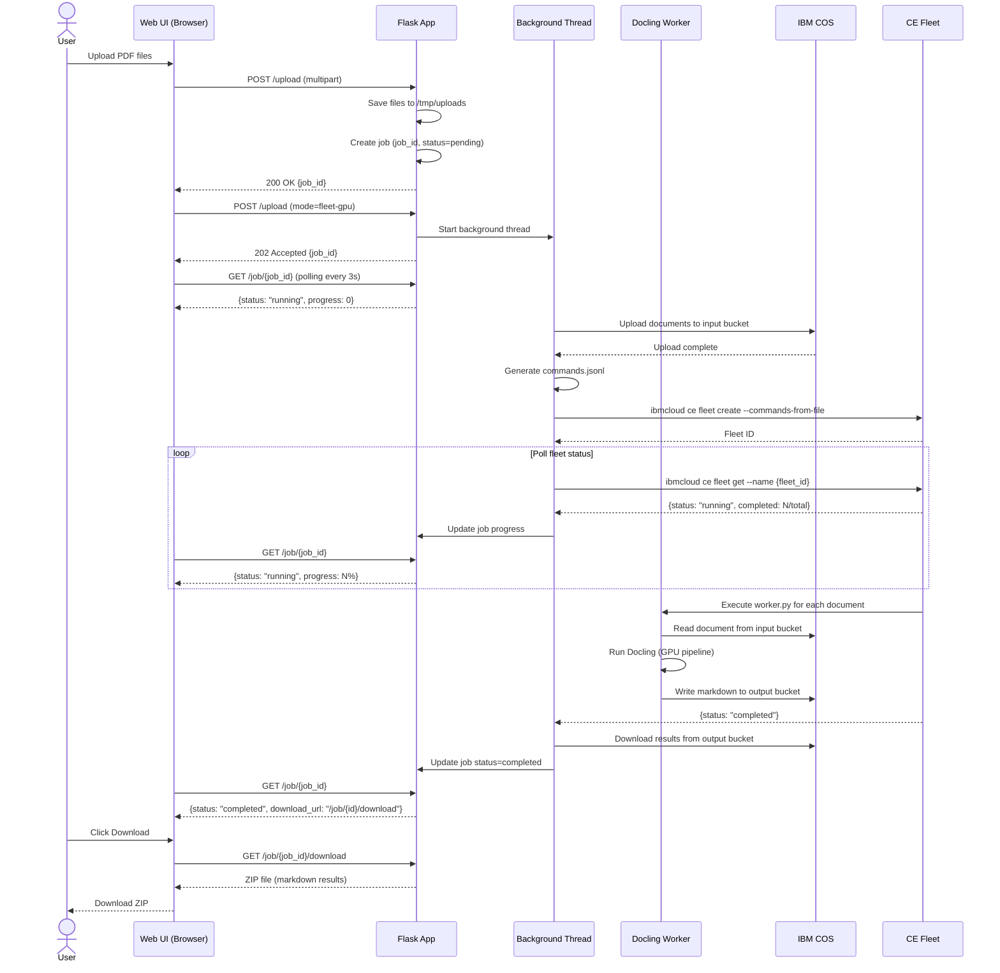

---

## 9. Sequence Diagram — Fleet Lifecycle

How Code Engine Serverless Fleets are created, run, and terminated.

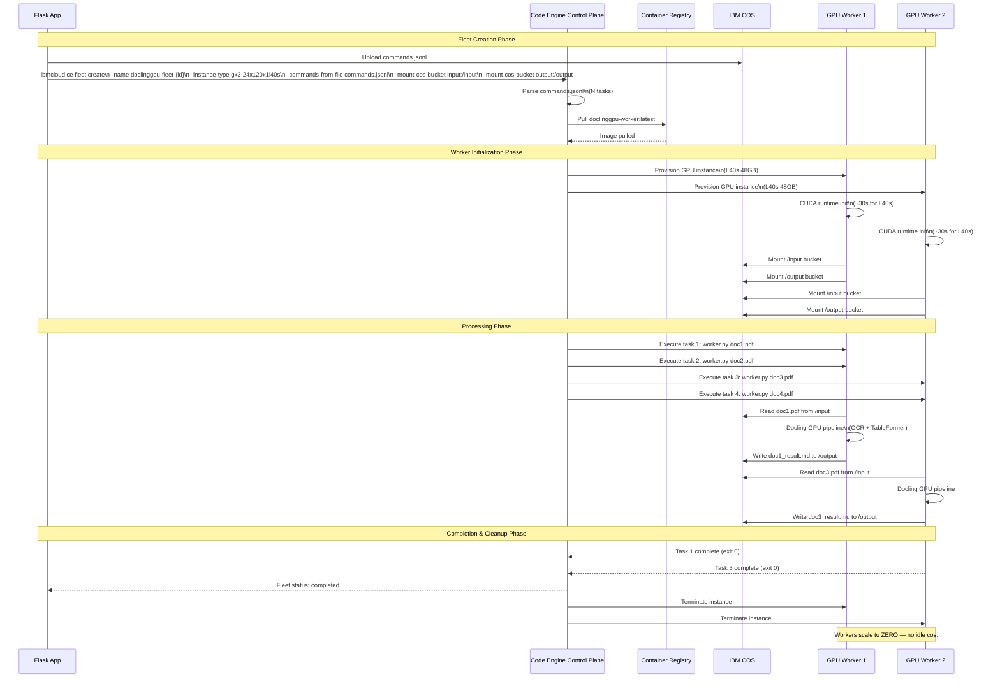

---

## 10. State Machine — Job Lifecycle

State transitions for a document processing job.

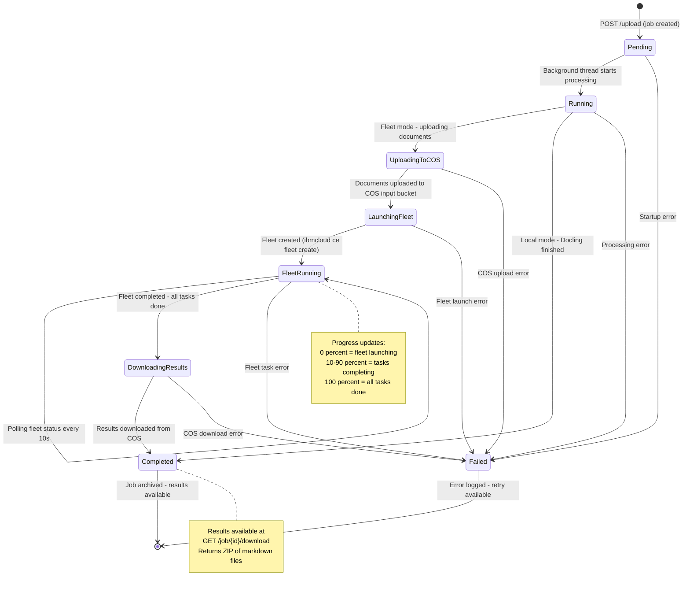

---

## 11. Infrastructure — Terraform Provisioning

IBM Cloud resources provisioned by Terraform.

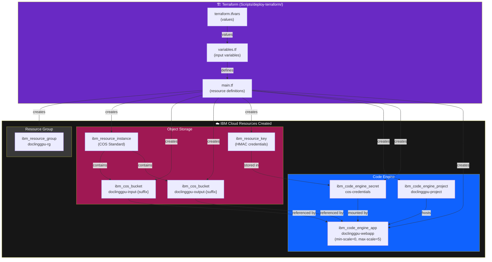

---

## 12. Container Architecture

Docker container structure and relationships.

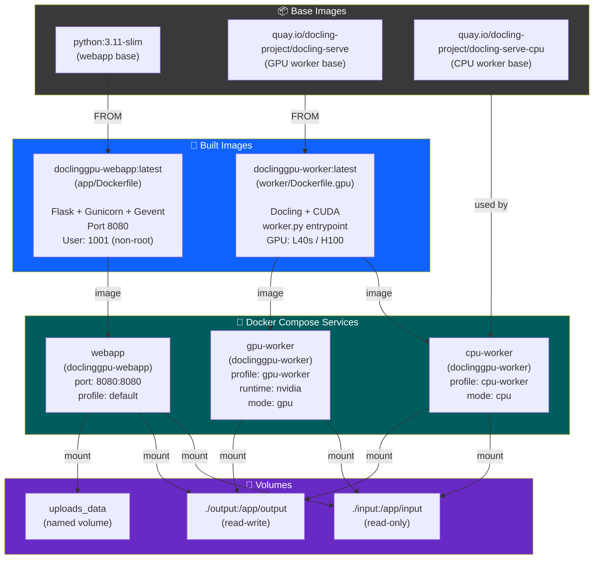

---

## 13. Network Architecture

Network topology and communication paths.

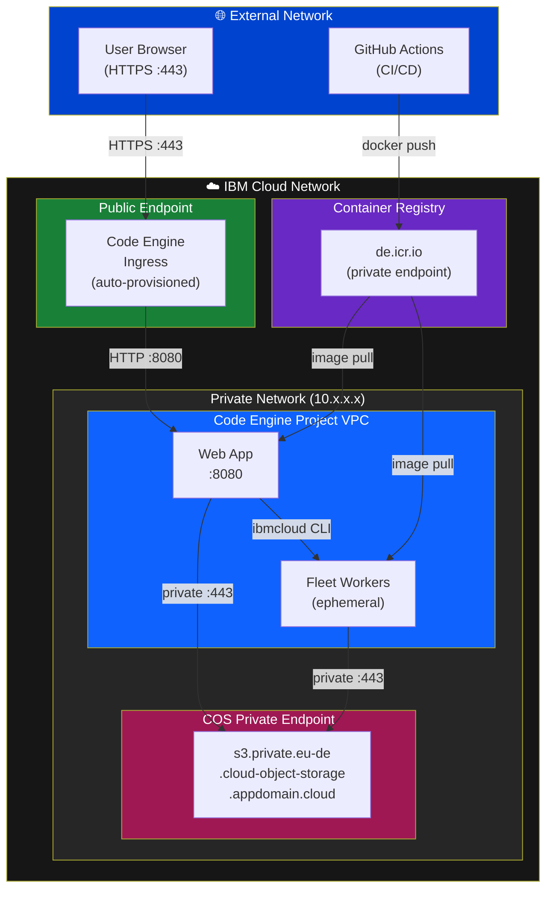

---

## 14. Security Architecture

Security controls and authentication flows.

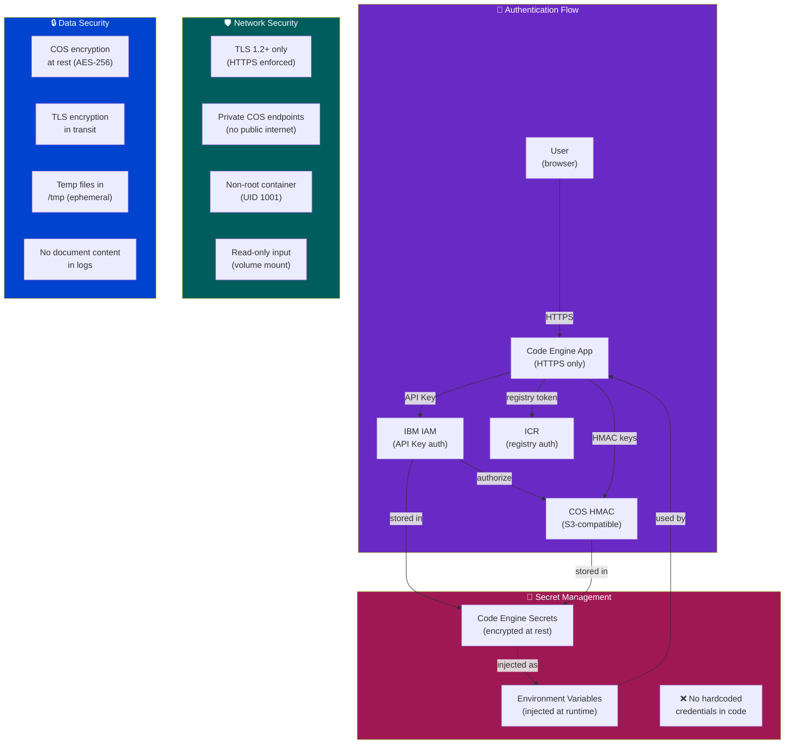

---

## Summary

The DoclingGPU architecture is designed around three core principles:

1. **Cost Efficiency**: Fleet workers scale to zero when idle. GPU instances are provisioned only for the duration of document processing, then terminated automatically.

2. **Scalability**: The Code Engine application auto-scales from 0 to N instances based on HTTP traffic. Fleet workers scale horizontally based on the number of documents in `commands.jsonl`.

3. **Flexibility**: Three processing modes (local, fleet-cpu, fleet-gpu) allow the same application to run on a developer laptop, a CPU cluster, or a GPU-accelerated cloud fleet — with no code changes.

For deployment instructions, see [DEPLOYMENT.md](./DEPLOYMENT.md).
For local development setup, see [LOCAL_DEVELOPMENT.md](./LOCAL_DEVELOPMENT.md).
For API reference, see [API.md](./API.md).